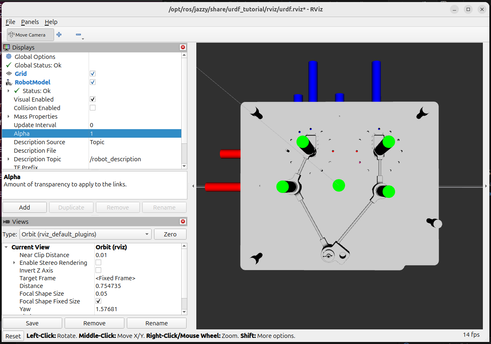
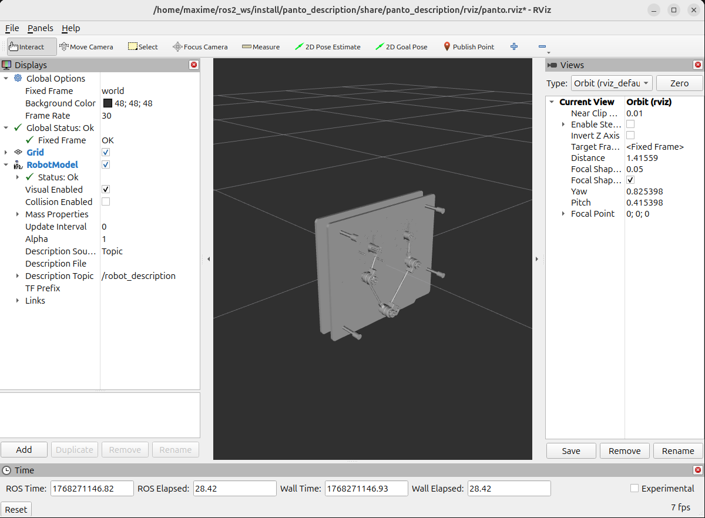
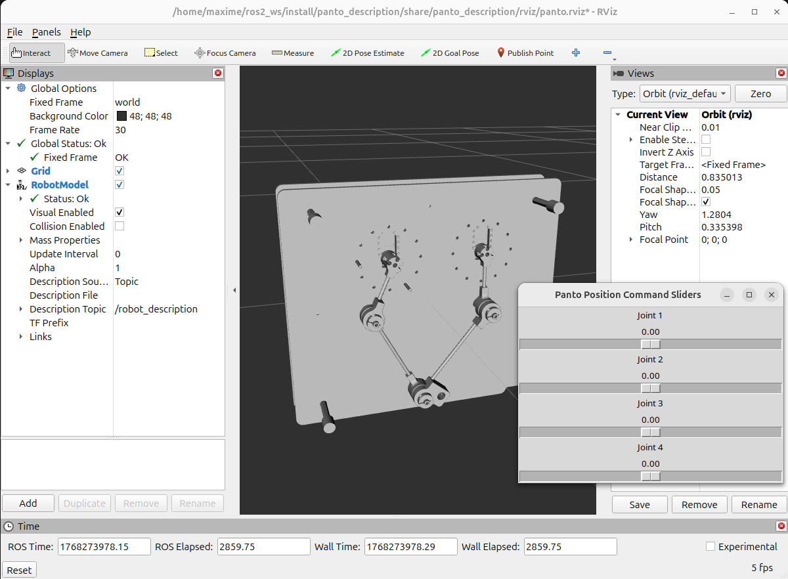

###################################################
 Génération de la description URDF du pantographe
###################################################

Nous allons utiliser le modèle 3D au format step conçu et réalisé par M. Olivier PICCIN pour générer la description URDF du pantographe.

.. figure:: resources/img/pantograph_step_model.png
   :align: center

Il s'agit d'un assemblage comportant 5 pièces principales :

  #. BATI_ASM: le bâti de la strucuture du pantographe avec les 2 moteurs pas à pas. Dans l'URDF nous allons le nommer ``base``.
  #. LINK1_ASM: le bras gauche du pantographe. Dans l'URDF nous allons le nommer ``link1``.
  #. LINK2_ASM: l'avant bras gauche du pantographe. Dans l'URDF nous allons le nommer ``link2``.
  #. LINK3_ASM: l'avant bras droit du pantographe. Dans l'URDF nous allons le nommer ``link3``.
  #. LINK4_ASM: le bras droit du pantographe. Dans l'URDF nous allons le nommer ``link4``.

:download:`maquette-5-barres_asm.stp <resources/cad/maquette-5-barres_asm.stp>`

Du point de vue URDF, nous aurons aussi besoin de définir l'outil de travail: le crayon et donc de le référencer par rapport à son support qui se trouve être sur l'avant bras gauche du pentographe (``link2``).

Dans un fichier URDF, les modèles 3D sont utilisés à partir de fichiers collada (extension .dae).
Il va donc falloir convertir notre modèle 3D au format step en un ensemble de 5 modèles 3D au format collada.

==================================
Extraction des modèles 3D en step
==================================

Pour extraire les modèles 3D au format step, vous pouvez utiliser le logiciel freecad.
   
   #. :download:`base.stp <resources/cad/base.stp>`
   #. :download:`link1.stp <resources/cad/link1.stp>`
   #. :download:`link2.stp <resources/cad/link2.stp>`
   #. :download:`link3.stp <resources/cad/link3.stp>`
   #. :download:`link4.stp <resources/cad/link4.stp>`

=====================================
Conversion des modèles 3D en collada
=====================================

Pour convertir les modèles 3D en collada (dae), vous pouvez utiliser le logiciel freecad.
   
   #. :download:`base.dae <resources/cad/base.dae>`
   #. :download:`link1.dae <resources/cad/link1.dae>`
   #. :download:`link2.dae <resources/cad/link2.dae>`
   #. :download:`link3.dae <resources/cad/link3.dae>`
   #. :download:`link4.dae <resources/cad/link4.dae>`

===================
Création du package
===================

Tout d'abord créer le package du pantographe.

.. code-block:: bash
   
   ros2 pkg create panto_description --build-type ament_cmake

on devrait obtenir une arborescence de ce type

.. code-block:: bash
   
   panto_description/
   |__CMakeLists.txt
   |__package.xml
   |__src/

===============================
Création des dossiers standards
===============================

Créer les dossiers standards launch, meshes et urdf

.. code-block:: bash
   
   cd panto_description

.. code-block:: bash
   
   mkdir urdf meshes launch ros2_control config rviz gazebo

Vous devriez obtenir l'arborescence suivante

.. code-block:: bash
   
   panto_description/
   |__CMakeLists.txt
   |__package.xml
   |__src/
   |__launch/
   |__urdf/
   |__meshes/
   |__ros2_control/
   |__config/
   |__rviz/
   |__gazebo/

Copier les fichiers collada dans le répertoire panto_description/meshes/

Ouvrir le fichier CMakeLists.txt et remplacer par

.. code-block:: bash
   
   cmake_minimum_required(VERSION 3.8)
   project(panto_description)
   
   find_package(ament_cmake REQUIRED)
   
   install(
      DIRECTORY urdf meshes launch ros2_control config rviz gazebo
      DESTINATION share/${PROJECT_NAME}
   )
   ament_package()

Modifier le fichier package.xml pour qu'il devienne

.. code-block:: bash

    <?xml version="1.0"?>
    <?xml-model href="http://download.ros.org/schema/package_format3.xsd" schematypens="http://www.w3.org/2001/XMLSchema"?>
    <package format="3">
        <name>panto_description</name>
        <version>0.0.0</version>
        <description>TODO: Package description</description>
        <maintainer email="maxime@todo.todo">maxime</maintainer>
        <license>TODO: License declaration</license>

        <buildtool_depend>ament_cmake</buildtool_depend>

        <exec_depend>robot_state_publisher</exec_depend>
        <exec_depend>joint_state_publisher_gui</exec_depend>
        <exec_depend>rviz2</exec_depend>

        <test_depend>ament_lint_auto</test_depend>
        <test_depend>ament_lint_common</test_depend>

        <export>
            <build_type>ament_cmake</build_type>
        </export>
    </package>

On va ensuite installer un package permettant la visualisation rapide du fichier urdf pour aider à sa construction.

Déplacez-vous à la racine de la machine

.. code-block:: bash

   cd ~

Installer le package ros-$ROS_DISTRO-urdf-tutorial

.. code-block:: bash
   sudo apt install ros-$ROS_DISTRO-urdf-tutorial

.. note ::

   Si la commande précédente ne fonctionne pas remplacer $ROS_DISTRO par votre distribution (Humble, Jazzy, ...)

Sourcer la distribution ros

.. code-block:: bash

   source /opt/ros/$ROS_DISTRIB/setup.bash

=========================
Création du fichier URDF
=========================

Créer un fichier urdf dans le répertoire panto_description/urdf

.. code-block:: bash
   
   cd urdf

.. code-block:: bash
   
   touch panto.urdf

Le fichier urdf va se structurer de la manière suivante
Un en-tête

.. code-block:: bash

    <?xml version="1.0"?>
    <robot name="panto" xmlns:xacro="http://www.ros.org/wiki/xacro">

.. note::

   Pour modifier le nom du robot modifier la variable robot name (ligne 2)

Un link fixe qui servira de référentiel.

.. code-block:: bash

   <link name="world"/>

De links_ qui seront les parts de votre système

.. code-block:: bash

        <link name="base_link">
            <visual>
                <geometry>
                    <mesh filename="package://panto_description/meshes/base.dae" scale="1 1 1"/>
                </geometry>
                <origin xyz="0 0 0" rpy="0 0 0" />
            </visual>
        </link>

.. note::

   Dans un fichier URDF les modèles 3D sont référencés par des balises ``<mesh>``. Le filename sera le chemin relatif au package et non relatif à la position du fichier urdf

De joints qui vont lier les links_ entre eux. Il existe différents types de joints_

.. code-block:: bash

        <joint name="base2world" type="fixed">
            <parent link="world"/>
            <child link="base_link"/>
        </joint>

.. note::

   Un fichier urdf n'admet pas de boucle cinématique. Il faut alors créer 2 branches ouvertes que nous lieront par contrainte géométrique plus tard.

Copier le code urdf suivant dans le fichier panto.urdf

.. code-block:: bash
   
    <?xml version="1.0"?>
    <robot name="panto" xmlns:xacro="http://www.ros.org/wiki/xacro">

        <!-- Link pour fixer la base -->
        <link name="world"/>

        <link name="base_link">
            <visual>
                <geometry>
                    <mesh filename="package://panto_description/meshes/base.dae" scale="1 1 1"/>
                </geometry>
                <origin xyz="0 0 0" rpy="0 0 0" />
            </visual>
        </link>

        <joint name="base2world" type="fixed">
            <parent link="world"/>
            <child link="base_link"/>
        </joint>

        <link name="link1">
            <visual>
                <geometry>
                    <mesh filename="package://panto_description/meshes/link1.dae" scale="1 1 1"/>
                </geometry>
                <origin xyz="0.08 0 -0.07" rpy="0 0 0" />
            </visual>
        </link>

        <joint name="base_link_link1_joint" type="revolute">
            <parent link="base_link"/>
            <child link="link1"/>
            <origin xyz="-0.08 0 0.07" rpy="0 0 0"/>
            <axis xyz="0 1 0"/>
            <limit effort="10" lower="-1.57" upper="1.57" velocity="1.0"/>
        </joint>

        <link name="link2">
            <visual>
                <geometry>
                    <mesh filename="package://panto_description/meshes/link2.dae" scale="1 1 1"/>
                </geometry>
                <origin xyz="0.08 0 0.01" rpy="0 0 0" />
            </visual>
        </link>

        <joint name="link1_link2_joint" type="revolute">
            <parent link="link1"/>
            <child link="link2"/>
            <origin xyz="0 0 -0.08" rpy="0 0 0"/>
            <axis xyz="0 1 0"/>
            <limit effort="10" lower="-1.57" upper="1.57" velocity="1.0"/>
        </joint>

        <link name="link4">
            <visual>
                <geometry>
                    <mesh filename="package://panto_description/meshes/link4.dae" scale="1 1 1"/>
                </geometry>
                <origin xyz="-0.058 0 -0.07" rpy="0 0 0" />
            </visual>
        </link>

        <joint name="base_link_link4_joint" type="revolute">
            <parent link="base_link"/>
            <child link="link4"/>
            <origin xyz="0.058 0 0.070" rpy="0 0 0"/>
            <axis xyz="0 1 0"/>
            <limit effort="10" lower="-1.57" upper="1.57" velocity="1.0"/>
        </joint>

        <link name="link3">
            <visual>
                <geometry>
                    <mesh filename="package://panto_description/meshes/link3.dae" scale="1 1 1"/>
                </geometry>
                <origin xyz="-0.0902347 0 0.00212437" rpy="0 0 0" />
            </visual>
        </link>

        <joint name="link4_link3_joint" type="revolute">
            <parent link="link4"/>
            <child link="link3"/>
            <origin xyz="0.0322347 0 -0.07212437" rpy="0 0 0"/>
            <axis xyz="0 1 0"/>
            <limit effort="10" lower="-1.57" upper="1.57" velocity="1.0"/>
        </joint>

    </robot>

==============================
Affichage de l'URDF dans RViz
==============================

Déplacez-vous dans le répertoire contenant le fichier urdf

.. code-block:: bash

   cd panto_description/urdf/

Obtener le chemin absolu de ce répertoire en entrant la commande :

.. code-block!! bash

   pwd

Lancer l'affichage de l'URDF en entrant la commande :

.. code-block:: bash

   ros2 launch urdf_tutorial display.launch.py model:=/<chemin absolu>/panto.urdf

Vous devez obtenir ceci :

.. note::

   N'hésitez pas à lancer régulièrement l'affichage de l'urdf durant sa construction afin de bien configurer les joints entre les links

   To do : Décrire le process avec creo

============================
Création fichier launch
============================

Déplacez-vous dans launch

.. code-block:: bash

   cd panto_description/launch

Créer un fichier display.launch.xml

.. code-block:: bash

   touch display.launch.xml

Modifier le fichier display.launch.xml pour qu'il soit

.. code-block:: bash

    <launch>
        <let name="urdf_path" value="$(find-pkg-share panto_description)/urdf/panto.urdf"/>
        <let name="rviz_config_path" value="$(find-pkg-share panto_description)/rviz/panto.rviz"/>
        <node pkg="robot_state_publisher" exec="robot_state_publisher">
        <param name="robot_description" value="$(command 'xacro $(var urdf_path)')"/>
        </node>
        <node pkg="joint_state_publisher_gui" exec="joint_state_publisher_gui"/>
        <node pkg="rviz2" exec="rviz2" output="screen" args="-d $(var rviz_config_path)"/>
    </launch>

Compiler et sourcer le package dans votre workspace

.. code-block:: bash

   colcon build

.. code-block:: bash

   source install/setup.bash

Pour lancer le fichier launch utiliser la commande

.. code-block:: bash

   ros2 launch panto_description display.launch.xml

============================
Création fichier ros2_control
============================

Le fichier ros2_control sert d'interfaçage hardware/software. Afin de le créer placer vous dans le répertoire ros2_control

.. code-block:: bash

   cd panto_description/ros2_control

Créer un fichier panto.ros2_control.urdf

.. code-block:: bash

   touch panto.ros2_control.urdf

Copier le code suivant dans le fichier panto.ros2_control.urdf

.. code-block:: bash

    <?xml version="1.0"?>
    <robot name = "panto" xmlns:xacro="http://www.ros.org/wiki/xacro">
    
        <ros2_control name="panto" type="system">
            <hardware>
            <plugin>mock_components/GenericSystem</plugin>
            </hardware>
    
            <joint name="base_link_link1_joint">
            <command_interface name="position"/>
            <state_interface name="position"/>
            </joint>
            <joint name="base_link_link4_joint">
            <command_interface name="position"/>
            <state_interface name="position"/>
            </joint>
    
    
            <joint name="link1_link2_joint">
            <command_interface name="position"/>
            <state_interface name="position"/>
            </joint>
    
            <joint name="link4_link3_joint">
            <command_interface name="position"/>
            <state_interface name="position"/>
            </joint>
        </ros2_control>
    
    </robot>

========================================================================================
Création d'un fichier Xacro combinant la description urdf et la description ros2_control
========================================================================================

Déplacez-vous dans le répertoire config

.. code-block:: bash

   cd ros2_ws/src/panto_description/config

Créer un fichier xacro

.. code-block:: bash

   touch panto.config.xacro

Copier coller ce code à l'intérieur de panto.config.xacro

.. code-block:: bash

   <?xml version="1.0"?>
   <!-- Pantographe -->
   <robot xmlns:xacro="http://www.ros.org/wiki/xacro" name="panto">
   
       <!-- Import panto urdf file -->
       <xacro:include filename="$(find panto_description)/urdf/panto.urdf" />
   
       <!-- Import panto ros2_control description -->
       <xacro:include filename="$(find panto_description)/ros2_control/panto.ros2_control.urdf" />
   
   </robot>

Ce fichier xacro permet de réunir la description urdf et ros2_control au sein d'un même fichier.

=========================================
Création d'une configuration ros2_control
=========================================

Déplacez-vous dans le répertoire config

.. code-block:: bash

   cd ros2_ws/src/panto_description/config

Créer un fichier panto_controllers.yaml

.. code-block:: bash

   touch panto_controllers.yaml

Ce fichier permettra d'associer à chaque liaison un controller spécifique de ros2_control. Ici, nous allons utiliser deux controller généralement utilisés qui sont joint_state_broadcaster et forward_command_controller. Le premier sert à obtenir la position, la vitesse et l'effort dans chaque liaison. Le deuxième est un controller de position d'une liaison.

Voici le code à écrire dans ce fichier dans le cas du pantographe.

.. code-block:: bash

   controller_manager:
     ros__parameters:
       update_rate: 100  # Hz
       
       joint_state_broadcaster:
         type: joint_state_broadcaster/JointStateBroadcaster
       
       panto_position_controller:
         type: forward_command_controller/ForwardCommandController
   
   panto_position_controller:
     ros__parameters:
       interface_name: position
       joints:
         - base_link_link1_joint
         - link1_link2_joint
         - base_link_link4_joint
         - link4_link3_joint

==============================================
Création d'un fichier launch pour ros2_control
==============================================

Tout d'abord créer un fichier de configuration de rviz.

Déplacez-vous dans le répertoire rviz.

.. code-block:: bash

   cd panto_description/rviz

Créer un fichier panto.rviz

.. code-block:: bash

   touch panto.rviz

Copier collé ce code à l'intérieur. Il permet de configurer la vue dans rviz et de déclarer les links qui seront présents.

.. code-block:: bash

   Panels:
     - Class: rviz_common/Displays
       Help Height: 78
       Name: Displays
       Property Tree Widget:
         Expanded:
           - /Global Options1
           - /Status1
           - /RobotModel1
         Splitter Ratio: 0.5
       Tree Height: 549
     - Class: rviz_common/Selection
       Name: Selection
     - Class: rviz_common/Tool Properties
       Expanded:
         - /2D Goal Pose1
         - /Publish Point1
       Name: Tool Properties
       Splitter Ratio: 0.5886790156364441
     - Class: rviz_common/Views
       Expanded:
         - /Current View1
       Name: Views
       Splitter Ratio: 0.5
     - Class: rviz_common/Time
       Experimental: false
       Name: Time
       SyncMode: 0
       SyncSource: ""
   Visualization Manager:
     Class: ""
     Displays:
       - Alpha: 0.5
         Cell Size: 1
         Class: rviz_default_plugins/Grid
         Color: 160; 160; 164
         Enabled: true
         Line Style:
           Line Width: 0.029999999329447746
           Value: Lines
         Name: Grid
         Normal Cell Count: 0
         Offset:
           X: 0
           Y: 0
           Z: 0
         Plane: XY
         Plane Cell Count: 10
         Reference Frame: <Fixed Frame>
         Value: true
       - Alpha: 1
         Class: rviz_default_plugins/RobotModel
         Collision Enabled: false
         Description File: ""
         Description Source: Topic
         Description Topic:
           Depth: 5
           Durability Policy: Volatile
           History Policy: Keep Last
           Reliability Policy: Reliable
           Value: /robot_description
         Enabled: true
         Links:
           All Links Enabled: true
           Expand Joint Details: false
           Expand Link Details: false
           Expand Tree: false
           Link Tree Style: Links in Alphabetic Order
           base_link:
             Alpha: 1
             Show Axes: false
             Show Trail: false
             Value: true
           link1:
             Alpha: 1
             Show Axes: false
             Show Trail: false
             Value: true
           link2:
             Alpha: 1
             Show Axes: false
             Show Trail: false
             Value: true
           link3:
             Alpha: 1
             Show Axes: false
             Show Trail: false
             Value: true
           link4:
             Alpha: 1
             Show Axes: false
             Show Trail: false
             Value: true
           world:
             Alpha: 1
             Show Axes: false
             Show Trail: false
         Mass Properties:
           Inertia: false
           Mass: false
         Name: RobotModel
         TF Prefix: ""
         Update Interval: 0
         Value: true
         Visual Enabled: true
     Enabled: true
     Global Options:
       Background Color: 48; 48; 48
       Fixed Frame: world
       Frame Rate: 30
     Name: root
     Tools:
       - Class: rviz_default_plugins/Interact
         Hide Inactive Objects: true
       - Class: rviz_default_plugins/MoveCamera
       - Class: rviz_default_plugins/Select
       - Class: rviz_default_plugins/FocusCamera
       - Class: rviz_default_plugins/Measure
         Line color: 128; 128; 0
       - Class: rviz_default_plugins/SetInitialPose
         Covariance x: 0.25
         Covariance y: 0.25
         Covariance yaw: 0.06853891909122467
         Topic:
           Depth: 5
           Durability Policy: Volatile
           History Policy: Keep Last
           Reliability Policy: Reliable
           Value: /initialpose
       - Class: rviz_default_plugins/SetGoal
         Topic:
           Depth: 5
           Durability Policy: Volatile
           History Policy: Keep Last
           Reliability Policy: Reliable
           Value: /goal_pose
       - Class: rviz_default_plugins/PublishPoint
         Single click: true
         Topic:
           Depth: 5
           Durability Policy: Volatile
           History Policy: Keep Last
           Reliability Policy: Reliable
           Value: /clicked_point
     Transformation:
       Current:
         Class: rviz_default_plugins/TF
     Value: true
     Views:
       Current:
         Class: rviz_default_plugins/Orbit
         Distance: 2.7850098609924316
         Enable Stereo Rendering:
           Stereo Eye Separation: 0.05999999865889549
           Stereo Focal Distance: 1
           Swap Stereo Eyes: false
           Value: false
         Focal Point:
           X: 0
           Y: 0
           Z: 0
         Focal Shape Fixed Size: true
         Focal Shape Size: 0.05000000074505806
         Invert Z Axis: false
         Name: Current View
         Near Clip Distance: 0.009999999776482582
         Pitch: 0.41539815068244934
         Target Frame: <Fixed Frame>
         Value: Orbit (rviz)
         Yaw: 0.825397789478302
       Saved: ~
   Window Geometry:
     Displays:
       collapsed: false
     Height: 846
     Hide Left Dock: false
     Hide Right Dock: false
     QMainWindow State: 000000ff00000000fd000000040000000000000156000002b0fc0200000008fb0000001200530065006c0065006300740069006f006e00000001e10000009b0000005c00fffffffb0000001e0054006f006f006c002000500072006f007000650072007400690065007302000001ed000001df00000185000000a3fb000000120056006900650077007300200054006f006f02000001df000002110000018500000122fb000000200054006f006f006c002000500072006f0070006500720074006900650073003203000002880000011d000002210000017afb000000100044006900730070006c006100790073010000003d000002b0000000c900fffffffb0000002000730065006c0065006300740069006f006e00200062007500660066006500720200000138000000aa0000023a00000294fb00000014005700690064006500530074006500720065006f02000000e6000000d2000003ee0000030bfb0000000c004b0069006e0065006300740200000186000001060000030c00000261000000010000010f000002b0fc0200000003fb0000001e0054006f006f006c002000500072006f00700065007200740069006500730100000041000000780000000000000000fb0000000a00560069006500770073010000003d000002b0000000a400fffffffb0000001200530065006c0065006300740069006f006e010000025a000000b200000000000000000000000200000490000000a9fc0100000001fb0000000a00560069006500770073030000004e00000080000002e10000019700000003000004b00000003efc0100000002fb0000000800540069006d00650100000000000004b0000002fb00fffffffb0000000800540069006d006501000000000000045000000000000000000000023f000002b000000004000000040000000800000008fc0000000100000002000000010000000a0054006f006f006c00730100000000ffffffff0000000000000000
     Selection:
       collapsed: false
     Time:
       collapsed: false
     Tool Properties:
       collapsed: false
     Views:
       collapsed: false
     Width: 1200
     X: 2082
     Y: 117

Ensuite, nous allons créer un nouveau package nommé panto_bringup. Donc déplacer-vous dans le répertoire src.

.. code-block:: bash

   cd ros2_ws/src

Créer un package panto_bringup

.. code-block:: bash
   
   ros2 pkg create panto_bringup --build-type ament_cmake

On devrait obtenir une arborescence de ce type :

.. code-block:: bash
   
   panto_bringup/
   |__include/
   |__CMakeLists.txt
   |__package.xml
   |__src/

Vous pouvez supprimez les répertoires include et src, et créer 2 nouveaux répertoires nommés config et launch

.. code-block:: bash

   rm -r include src

.. code-block:: bash

   mkdir config launch

Modifier le fichier CMakeLists.txt dans ce même package pour qu'il devienne :

.. code-block:: bash

   cmake_minimum_required(VERSION 3.8)
   project(panto_bringup)
   
   if(CMAKE_COMPILER_IS_GNUCXX OR CMAKE_CXX_COMPILER_ID MATCHES "Clang")
     add_compile_options(-Wall -Wextra -Wpedantic)
   endif()
   
   # find dependencies
   find_package(ament_cmake REQUIRED)
   
   install(
     DIRECTORY config launch
     DESTINATION share/${PROJECT_NAME}
   )
   
   ament_package()

Dans le répertoire launch, créer un fichier panto.launch.py

.. code-block:: bash

   cd panto_bringup/launch

.. code-block:: bash

   touch panto.launch.py

Copier coller le code suivant dans le fichier panto.launch.py. Il permettra de lancer successivement les différents noeuds nécessaire pour afficher le robot et importer les infertaces hardware.

.. code-block:: bash

   from launch import LaunchDescription
   from launch.actions import TimerAction
   from launch.substitutions import Command, FindExecutable, PathJoinSubstitution
   from launch_ros.actions import Node
   from launch_ros.substitutions import FindPackageShare
   
   
   def generate_launch_description():
   
       # =======================
       # Robot description (xacro)
       # =======================
       robot_description_content = Command(
           [
               PathJoinSubstitution([FindExecutable(name='xacro')]),
               ' ',
               PathJoinSubstitution([
                   FindPackageShare('panto_description'),
                   'config',
                   'panto.config.xacro'
               ]),
           ]
       )
   
       robot_description = {'robot_description': robot_description_content}
   
       # =======================
       # Controllers config
       # =======================
       robot_controllers = PathJoinSubstitution([
           FindPackageShare('panto_description'),
           'config',
           'panto_controllers.yaml'
       ])
   
       # =======================
       # RViz config
       # =======================
       rviz_config_file = PathJoinSubstitution([
           FindPackageShare('panto_description'),
           'rviz',
           'panto.rviz'
       ])
   
       # =======================
       # Nodes
       # =======================
   
       # robot_state_publisher
       robot_state_publisher_node = Node(
           package='robot_state_publisher',
           executable='robot_state_publisher',
           output='screen',
           parameters=[robot_description],
       )
   
       # ros2_control
       ros2_control_node = Node(
           package='controller_manager',
           executable='ros2_control_node',
           output='screen',
           parameters=[robot_description, robot_controllers],
       )
   
       # RViz
       rviz_node = Node(
           package='rviz2',
           executable='rviz2',
           name='rviz2',
           output='log',
           arguments=['-d', rviz_config_file],
       )
   
       # Joint state broadcaster
       joint_state_broadcaster_spawner = Node(
           package='controller_manager',
           executable='spawner',
           arguments=['joint_state_broadcaster'],
           output='screen',
       )
   
       # Position controller
       position_controller_spawner = Node(
           package='controller_manager',
           executable='spawner',
           arguments=['panto_position_controller'],
           output='screen',
       )
   
       # =======================
       # Launch order
       # =======================
       return LaunchDescription([
   
           # 1. URDF → TF
           robot_state_publisher_node,
   
           # 2. ros2_control
           ros2_control_node,
   
           # 3. RViz
           rviz_node,
   
           # 4. Spawners (avec délais pour laisser ros2_control démarrer)
           TimerAction(
               period=3.0,
               actions=[joint_state_broadcaster_spawner],
           ),
   
           TimerAction(
               period=5.0,
               actions=[position_controller_spawner],
           ),
       ])

Build tous les packages

.. code-block:: bash

   colcon build

Sourcer le terminal avec les nouveaux packages

.. code-block:: bash

   source install/setup.bash

Lancer le pantographe avec les controller ros2_control

.. code-block:: bash

   ros2 launch panto_bringup panto.launch.py

Nous obtenons normalement le lancement de rviz avec la maquette du pantographe avec les 8 interfaces et les 2 controllers de ros2_control.

Vous pouvez vérifier la présence des interfaces avec la commande :

.. code-block:: bash

   ros2 control list_hardware_interfaces

Vous devez voir ceci :

.. code-block:: bash

   command interfaces
   	base_link_link1_joint/position [available] [claimed]
   	base_link_link4_joint/position [available] [claimed]
   	link1_link2_joint/position [available] [claimed]
   	link4_link3_joint/position [available] [claimed]
   state interfaces
   	base_link_link1_joint/position
   	base_link_link4_joint/position
   	link1_link2_joint/position
   	link4_link3_joint/position

Il y a donc 4 interfaces de commandes (coommand interfaces), et 4 interfaces de récupération de donnéesc(state interfaces).

Pour vérifier la présence des controllers, il faut entrer la commande suivante :

.. code-block:: bash

   ros2 control list_controllers

Vous devez voir ceci :

.. code-block:: bash

   panto_position_controller forward_command_controller/ForwardCommandController  active
   joint_state_broadcaster   joint_state_broadcaster/JointStateBroadcaster        active

panto_position_controller permet de contrôler la position angulaire des liaisons pivots. joint_state_broadcaster permet de récupérer la position et la vitesse et l'effort dans chaque liaison.

Maintenant, si vous entrez cette commande : 

.. code-block:: bash

   ros2 topic list

Vous devriez voir ceci :

.. code-block:: bash

   /clicked_point
   /controller_manager/activity
   /controller_manager/introspection_data/full
   /controller_manager/introspection_data/names
   /controller_manager/introspection_data/values
   /controller_manager/statistics/full
   /controller_manager/statistics/names
   /controller_manager/statistics/values
   /diagnostics
   /dynamic_joint_states
   /goal_pose
   /initialpose
   /joint_state_broadcaster/transition_event
   /joint_states
   /panto_position_controller/commands
   /panto_position_controller/transition_event
   /parameter_events
   /robot_description
   /rosout
   /tf
   /tf_static

C'est la liste des topics actives. Celles qui nous intéresse est /panto_position_controller/commands. Maintenant, utiliser cette commande pour vérifier quel type de message accepte ce topic.

.. code-block:: bash

   ros2 topic info /panto_position_controller/commands

Vous obtenez ceci :

.. code-block:: bash

   Type: std_msgs/msg/Float64MultiArray
   Publisher count: 0
   Subscription count: 1

C'est le type de message qu'attend le topic. Maintenant, essayer de rentrer cette commande pour envoyer un message sur ce topic. Si tout se passe bien le pantographe est censé bouger.

.. code-block:: bash

   ros2 topic pub --once /panto_position_controller/commands std_msgs/msg/Float64MultiArray "{data: [0.5,-1.5,0.3,0.5]}"

=====================================================
Création d'un noeud python de commande du pantographe
=====================================================

L'objectif est de créer un noeud python se présentant sous la forme de 4 sliders permettant de controller chacune une liaison pivot à travers le topic /panto_position_controller/commands.

Déplacez vous dans le répertoire src du votre workspace.

.. code-block:: bash

   cd ros2_ws/src

Creer un package python avec rclpy et std_msgs en dépendances.

.. code-block:: bash

   ros2 pkg create cmd_slider_pub --build-type ament_python --dependencies rclpy std_msgs

Nous obtenons l'arborescence suivante :

.. code-block:: bash

   cmd_slider_pub/
   ├── package.xml
   ├── setup.py
   ├── setup.cfg
   ├── cmd_slider_pub/
   │   ├── __init__.py

Créer le fichier du noeud 

.. code-block:: bash

   cd cmd_slider_pub/cmd_slider_pub
   
.. code-block:: bash

   touch cmd_slider_pub.py

Ouvrez le fichier dans vscode.

.. code-block:: bash

   code cmd_slider_pub.py

Copier coller ce code à l'intérieur :

.. code-block:: bash

   #!/usr/bin/env python3
   
   import rclpy
   from rclpy.node import Node
   from std_msgs.msg import Float64MultiArray
   import tkinter as tk
   
   
   class CmdSliderPub(Node):
   
       def __init__(self):
           super().__init__('cmd_slider_pub')
   
           self.publisher_ = self.create_publisher(
               Float64MultiArray,
               '/panto_position_controller/commands',
               10
           )
   
           self.joint_values = [0.0, 0.0, 0.0, 0.0]
   
           self.timer = self.create_timer(0.1, self.publish_joint_positions)
   
           self.init_gui()
   
       def init_gui(self):
           self.root = tk.Tk()
           self.root.title("Panto Position Command Sliders")
   
           for i in range(4):
               tk.Label(self.root, text=f"Joint {i+1}").pack()
   
               tk.Scale(
                   self.root,
                   from_=-3.14,
                   to=3.14,
                   resolution=0.01,
                   orient=tk.HORIZONTAL,
                   length=400,
                   command=lambda val, idx=i: self.update_joint(idx, val)
               ).pack()
   
           self.root.protocol("WM_DELETE_WINDOW", self.on_close)
   
       def update_joint(self, index, value):
           self.joint_values[index] = float(value)
           self.publish_joint_positions()
   
       def publish_joint_positions(self):
           msg = Float64MultiArray()
           msg.data = self.joint_values
           self.publisher_.publish(msg)
   
       def on_close(self):
           self.get_logger().info("Shutting down cmd_slider_pub")
           self.root.destroy()
           rclpy.shutdown()
   
       def run(self):
           while rclpy.ok():
               self.root.update_idletasks()
               self.root.update()
   
   
   def main():
       rclpy.init()
       node = CmdSliderPub()
       node.run()
   
   
   if __name__ == '__main__':
       main()

Modifier ensuite le fichier setup.py pour rajouter le nouveau fichier en tant qu'éxécutable du package.

.. code-block:: bash

   entry_points={
       'console_scripts': [
           'cmd_slider_pub = cmd_slider_pub.cmd_slider_pub:main',
       ],
   },

Vérifier que les dépendances rclpy et std_msgs sont bien présente dans le fichier package.xml. Vous devez voir ceci à l'intérieur du fichier :

.. code-block:: bash

   <exec_depend>rclpy</exec_depend>
   <exec_depend>std_msgs</exec_depend>

Rendez ensuite le fichier du noeud exécutable :

.. code-block:: bash

   chmod +x cmd_slider_pub/cmd_slider_pub.py

Compiler le package

.. code-block:: bash

   cd ~/ros2_ws

.. code-block:: bash

   colcon build --packages-select cmd_slider_pub

Sourcer le workspace :

.. code-block:: bash

   source install/setup.bash

Lancer le noeud :

.. code-block:: bash

   ros2 run cmd_slider_pub cmd_slider_pub

Vérifier que le noeud publie sur le topic /panto_position_controller/commands

.. code-block:: bash

   ros2 launch panto_bringup panto.launch.py

.. code-block:: bash

   ros2 topic echo /panto_position_controller/commands

Vous devez ainsi voir ceci :

.. code-block:: bash

   layout:
     dim: []
     data_offset: 0
   data:
   - 0.65
   - -0.41
   - 0.0
   - 0.0
   ---
   layout:
     dim: []
     data_offset: 0
   data:
   - 0.65
   - -0.43
   - 0.0
   - 0.0
   ---

=====================================================================================================
Création d'un noeud python assurant 2 ddl pour les liaisons accrochées au bâti et 2 liaisons passives
=====================================================================================================

L'objectif est de créer un noeud python ayant 2 liaison pivot en degré de liberté et les 2 autres liaisons pivot seront passives et seront piloté de manière à assurer la contrainte géométrique de fermeture des branches ouvertes du pantographe au sommet.

Déplacez vous dans le répertoire où se trouve le précédent noeud python cmd_slider_pub.py.

.. code-block:: bash

   cd ros2_ws/src/cmd_slider_pub/cmd_slider_pub

Créer un nouveau fichier python.

.. code-block:: bash

   touch cmd_ferm_geom.py

Ouvrez ce fichier avec vscode

.. code-block:: bash

   code cmd_ferm_geom.py

Ce noeud nécessite le modèle géométrique inverse pour son bon fonctionnement. Malheureusement, nous n'avons pas eu le temps d'avoir un code satisfaisant pour ce noeud. Pour l'instant, nous pouvons proposer un noeud où les 2 liaisons pivots non reliées au bâti sont passives, c'est-à-dire qu'elles sont pilotées en fonction des commandes des 2 autres liaisons pivots. Pour l'instant, la relation de pilotage entre les liaisons actives et passives est fausse. Le code suivant permettra juste de démontrer que la mise en place de liaison passive et active est possible.

.. code-block:: bash

   #!/usr/bin/env python3
   
   import rclpy
   from rclpy.node import Node
   from std_msgs.msg import Float64MultiArray
   import tkinter as tk
   import math
   
   
   class CmdFermGeom(Node):
   
       def __init__(self):
           super().__init__('cmd_ferm_geom')
   
           self.publisher_ = self.create_publisher(
               Float64MultiArray,
               '/panto_position_controller/commands',
               10
           )
   
           # Angles moteurs
           self.theta1 = 0.0  # base_link_link1_joint
           self.theta4 = 0.0  # base_link_link4_joint
   
           self.init_gui()
           self.timer = self.create_timer(0.05, self.publish_commands)
   
       # =========================
       # GUI
       # =========================
       def init_gui(self):
           self.root = tk.Tk()
           self.root.title("Pentographe – fermeture géométrique simplifiée")
   
           tk.Label(self.root, text="θ1 (base → link1)").pack()
           self.slider1 = tk.Scale(
               self.root, from_=-1.57, to=1.57,
               resolution=0.01, orient=tk.HORIZONTAL,
               length=400, command=self.update_theta1
           )
           self.slider1.pack()
   
           tk.Label(self.root, text="θ4 (base → link4)").pack()
           self.slider4 = tk.Scale(
               self.root, from_=-1.57, to=1.57,
               resolution=0.01, orient=tk.HORIZONTAL,
               length=400, command=self.update_theta4
           )
           self.slider4.pack()
   
           self.root.protocol("WM_DELETE_WINDOW", self.on_close)
   
       def update_theta1(self, value):
           self.theta1 = float(value)
   
       def update_theta4(self, value):
           self.theta4 = float(value)
   
       # =========================
       # Fermeture simplifiée
       # =========================
       def compute_passive_joints(self):
           theta2 = math.pi - self.theta1
           theta3 = math.pi - self.theta4
           return theta2, theta3
   
       # =========================
       # Publication
       # =========================
       def publish_commands(self):
           theta2, theta3 = self.compute_passive_joints()
   
           msg = Float64MultiArray()
           msg.data = [
               self.theta1,
               self.theta4,
               theta2,
               theta3
           ]
   
           self.publisher_.publish(msg)
   
       def on_close(self):
           self.root.destroy()
           rclpy.shutdown()
   
       def run(self):
           while rclpy.ok():
               rclpy.spin_once(self, timeout_sec=0.0)
               self.root.update_idletasks()
               self.root.update()
   
   
   
   def main():
       rclpy.init()
       node = CmdFermGeom()
       node.run()
   
   
   if __name__ == '__main__':
       main()

N'oubliez de rajouter ce fichier dans les entry_points dans le fichier setup.py avant de compiler et sourcer.

.. code-block:: bash

   entry_points={
       'console_scripts': [
           'cmd_slider_pub = cmd_slider_pub.cmd_slider_pub:main',
           'cmd_ferm_geom = cmd_slider_pub.cmd_ferm_geom:main',
       ],
   }

.. _joints: https://wiki.ros.org/urdf/XML/joint
.. _links: https://wiki.ros.org/urdf/XML/link
