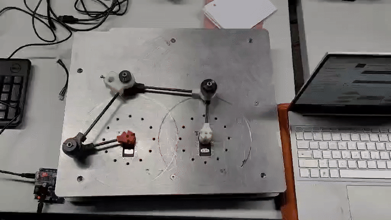

#########################################################
Fonctionnement des Dynamixels
#########################################################

********************************************************
Branchement des moteurs
********************************************************

Les moteurs sont connectés en série. Chaque moteur a une adresse unique qui lui permet d'être contrôlé individuellement par le contrôleur principal. Les câbles de données et d'alimentation doivent être correctement branchés pour assurer le bon fonctionnement des moteurs. Le convertisseur de communication USB U2D2 permet la communication entre la Raspberry et les moteurs. 

.. note::

   Des informations sur le branchement et une description plus détaillé de l'U2D2 sont trouvable dans cette documentation_.

********************************************************
Préparation des fichiers
********************************************************

Une fois les moteurs et l'U2D2 branchés, il faut préparer les fichiers nécessaires pour contrôler les moteurs. Voici les étapes à suivre :

#. Créez un répertoire pour votre projet :
   
.. code-block:: bash

   mkdir -p ~/ros2_ws/src

.. code-block:: bash

   cd ~/ros2_ws/src

#. Clonez le dépôt contenant les fichiers de configuration et les scripts nécessaires :

.. code-block:: bash

   git clone -b $ROS_DISTRO https://github.com/ROBOTIS-GIT/DynamixelSDK

.. note::

   Si jamais il y a un problème avec la commande précédente, il faut peut être remplacer "$ROS_DISTRO" par votre version de ROS2 qui est installé (jazzy, humble, ...)

#. Compilez le workspace ROS 2 :

.. code-block:: bash

   cd ~/ros2_ws

.. code-block:: bash
   
   ros2_build

#. Vérifier la connection au port USB et ajouter la permission

.. code-block:: bash

   ls /dev/tty*

.. code-block:: bash

   sudo usermod -aG dialout <compte_linux>

.. note:: 

   Pour trouver votre compte linux vous pouvez utiliser la commande :

.. code-block:: bash

   whoami

Ouvrir et autoriser l'accès en écriture du port USB

.. code-block:: bash

   sudo chmod 666 /dev/ttyUSB<n°USB>

.. note::

   Pour trouver votre n°USB regardez le résultat de la commande ls/dev/tty*. Si plusieurs ttyUSB existent débrancher le port USB à identifier et relancer ls/dev/tty* pour voir la différence

.. note:: 

   Les commandes précédentes proviennent de ce tutoriel_ vidéo

********************************************************
Adaptation du code
********************************************************

Le code récupéré sur github est adapté aux moteurs XL430-W250. Pour les adapter aux moteurs AX-12 que nous avons, nous devons adapter le code.

Il faut modifier le fichier **read_write_node.cpp** qui se trouve dans le dossier `~/robotis_ws/src/DynamixelSDK/dynamixel_sdk_examples/src`.

Dans ce fichier il faut changer les lignes 42 à 46 avec le code suivant :

.. code-block:: cpp

   // Control table address for X series (except XL-320)
   #define ADDR_OPERATING_MODE 255
   #define ADDR_TORQUE_ENABLE 24
   #define ADDR_GOAL_POSITION 30
   #define ADDR_PRESENT_POSITION 36

.. note:: 

   Les adresses à mettre peuvent se trouver dans le tableau `Control Table of RAM Area` de la datasheet_

Il faut aussi changer le Protocole de communication en 1.0 et non 2.0 (ligne 49) :

.. code-block:: cpp

   #define PROTOCOL_VERSION 1.0

Enfin il faut mettre à jour le `baudrate`. Ce dernier peut être trouvé avec ce logiciel_ et le changé à la ligne 52:

.. note::

   Si l'installation ne fonctionne pas vous pouvez essayer avec un `baudrate` de 115200

********************************************************
Mise en route du code
********************************************************

Si ce n'est pas fait il faut d'abord sourcer le projet et le rebuild  :

.. code-block:: bash

   source install/setup.bash

.. code-block:: bash

   ros2_build
   

Ensuite il faut faire la fin du tutoriel_ (les commandes sont écrite en dessous )

Lancer la node :

.. code-block:: bash

   ros2 run dynamixel_sdk_examples read_write_node

Dans un autre terminal on peut communiquer avec les moteurs en utilisant les commandes suivantes :

.. code-block:: bash

   # commande le moteur 1 à la position 1000
   ros2 topic pub -1 /set_position dynamixel_sdk_custom_interfaces/SetPosition "{id: 1, position: 1000}"

.. code-block:: bash

   # récupérer la position du moteur 2
   ros2 service call /get_position dynamixel_sdk_custom_interfaces/srv/GetPosition "id: 2"

On obtient alors ce résultat

.. _logiciel: https://emanual.robotis.com/docs/en/software/dynamixel/dynamixel_wizard2/
.. _tutoriel: https://www.youtube.com/watch?v=E8XPqDjof4U
.. _datasheet: https://emanual.robotis.com/docs/en/dxl/ax/ax-12a/
.. _documentation: https://emanual.robotis.com/docs/en/parts/interface/u2d2/
