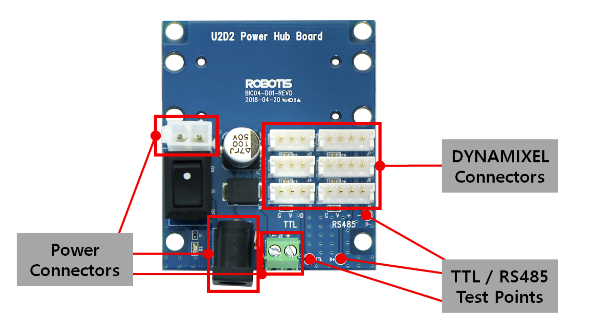
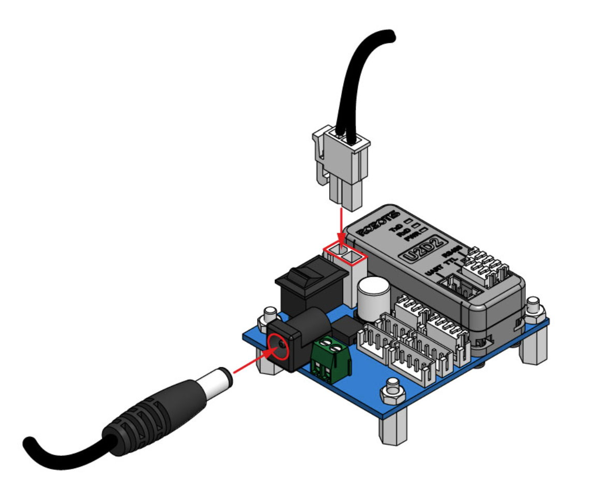
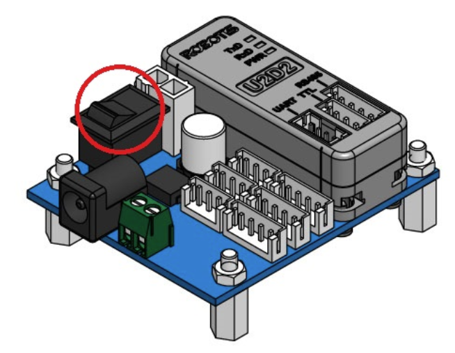

#########################################################
Fonctionnement des Servomoteurs Dynamixel AX-12A
#########################################################

Cette section décrit la procédure complète pour détecter, configurer et contrôler deux servomoteurs AX-12A montés sur la plateforme.
* `Lien code Github <https://github.com/AnthonyKilzi/informatique_industrielle_avec_ROS2_MaGdKa?tab=readme-ov-file>`_

********************************************************
Branchement des moteurs
********************************************************

Les moteurs Dynamixel sont connectés en série (**daisy chain**). Chaque moteur possède une adresse (ID) unique pour être contrôlé séparément. 

* **Interface** : La communication entre le PC et les moteurs passe par un convertisseur USB **U2D2**.

* **Alimentation** : Les moteurs AX-12A nécessitent une alimentation externe de **12V**.

Le branchement du convertisseur U2D2 est le suivant :

Pour allumer les moteurs, connectez une alimentation 12V aux bornes V+ et GND du U2D2, soit a l'aide d'une connecteur externe JST (Attention au sens du branchement), soit via un adaptateur secteur.

Il faut ensuite mettre sous tension grace à l'interrupteur situé sur le côté du U2D2.

********************************************************
Détection via Dynamixel Wizard 2.0
********************************************************

Avant de lancer un script, utilisez le logiciel `Dynamixel Wizard 2.0 <https://emanual.robotis.com/docs/en/software/dynamixel/dynamixel_wizard2/>`_ pour valider l'état du bus.

1. Sélectionnez le port (ex: ``COM4`` ou ``/dev/ttyUSB0`` pour la raspberry).
2. Configurez le protocole sur **1.0** (spécifique aux AX-12A).
3. Lancez le **Scan**.

D'après nos tests, les paramètres détectés sont :
* **Baudrate** : ``115200 bps``
* **IDs** : ``1`` et ``2``
* **Protocole** : ``1.0``

********************************************************
Mise en œuvre du contrôle Python
********************************************************

Pour piloter les moteurs, nous utilisons la bibliothèque officielle **Dynamixel SDK**.

Installation
------------

.. code-block:: bash

   pip install dynamixel-sdk

Configuration et adaptation du code
-----------------------------------

Pour que le code fonctionne avec des moteurs AX-12A, il est crucial d'adapter les adresses de la table de contrôle. Contrairement aux séries X, les AX-12A utilisent les constantes suivantes :

.. code-block:: python

   # Adresses de la table de contrôle (Datasheet AX-12A)
   ADDR_TORQUE_ENABLE    = 24  # Activation du couple
   ADDR_GOAL_POSITION    = 30  # Position cible (0-1023)
   ADDR_PRESENT_POSITION = 36  # Lecture position actuelle
   
   # Paramètres de communication
   PROTOCOL_VERSION      = 1.0       # Protocol 1.0 impératif
   BAUDRATE              = 115200    # Valeur trouvée via le Wizard
   DEVICENAME            = 'COM4'    # À changer en '/dev/ttyUSB0' sur Linux

Explications des variables à modifier :
+++++++++++++++++++++++++++++++++++++++

* **BAUDRATE** : Vérifiez si cette valeur est bien celle configurée dans le Wizard (souvent 115200 ou 1000000).
* **DEVICENAME** : Sous Windows, utilisez le port COM identifié. Sous Linux/Raspberry Pi, utilisez le chemin du port série (généralement ``/dev/ttyUSB0``).
* **ADDR_GOAL_POSITION** : Indique au SDK où écrire l'ordre de mouvement. Sur AX-12A, il s'agit de 2 octets (Write2Byte).

********************************************************
Guide de pilotage au clavier
********************************************************

Le script développé permet un contrôle indépendant ou combiné des deux servomoteurs.

.. code-block:: text

   Touches de contrôle :
   --------------------
   [A] / [D] : Moteur 1 (ID 1) - Rotation Gauche / Droite
   [W] / [S] : Moteur 2 (ID 2) - Rotation Haut / Bas
   [ESC]     : Quitter et désactiver le couple (Torque OFF)

********************************************************
Ressources supplémentaires
<<<<<<<<<<<<<<<<<<<<<<<<<<<<<<<<<<<<<<<<<<<<<<<<<<<<<<<<

* `Datasheet officielle AX-12A <https://emanual.robotis.com/docs/en/dxl/ax/ax-12a/>`_
* `Documentation interface U2D2 <https://emanual.robotis.com/docs/en/parts/interface/u2d2/>`_

********************************************************
Vidéo de démonstration
<<<<<<<<<<<<<<<<<<<<<<<<<<<<<<<<<<<<<<<<<<<<<<<<<<<<<<<<

Voici une animation montrant le fonctionnement des servomoteurs sur le pantographe :

.. image:: resources/img/Video_Pantogrpahe.gif
   :width: 70%
   :align: center

