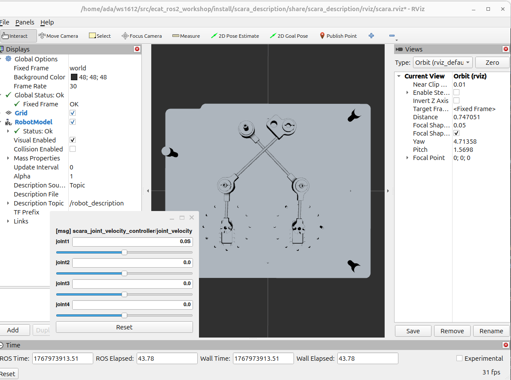

#######################
Visualisation du modèle
#######################

Il est possible de visualiser le modèle issu du fichier URDF du pantographe à l'aide de RViz. Cet outil peut être utilisé pour vérifier la validité du modèle lui-même, c'est pourquoi nous l'avons exposé au travers d'une launch file qui traite automatiquement le fichier contenant les macros Xacro. Cette approche est destinée au développement ; ainsi en production, il faudra utiliser le fichier URDF généré pour éviter le gaspillage de ressources.

Pour lancer la visualisation, utilisez la commande suivante :

.. code-block:: bash

   ros2 launch pantographe_description display.launch.py

Vous pouvez ainsi vous assurer du bon placement des repères et d'autres paramètres.

Etant donné que nous n'avons pas réussi à configurer le fichier URDF de manière à obtenir un système fermer, nous avons laissé tout les liens commandable et nous n'avons pas fermer le pantographe dans RViz. Le système est commandable à l'aide du scara_joint_velocity_controller. Afin d'utiliser ce contrôleur, il faut d'abord le configurer. 
Comme nous avons repris les codes du scara, il faut modifier le fichier `scara.ros2control.urdf`. Il faut modifier chaque joint que l'on souhaite ajouter de la manière suivante : 
.. code-block:: xml    
        <joint name="joint1" type="revolute">
            <command_interface name="position"/>
            <state_interface name="position">
                <param name="initial_value">-3.14</param>
                <param name="min">-5</param>
                <param name="max">5</param>
            </state_interface>
            <state_interface name="velocity">
                <param name="initial_value">0.0</param>
            </state_interface>
        </joint>

Dans ce fichier, nous avons ajouté une interface de commande en position et deux interfaces d'état (position et vitesse) pour chaque joint. Il y a aussi des paramètres pour définir la valeur initiale, la valeur minimale et maximale pour chaque joint.

Ensuite, il faut modifier `scara_control.yaml` et selectionner y ajouter les joints que l'on souhaite commander. Dans notre cas, nous avons ajouté les quatre joints du pantographe. Voici un extrait du fichier modifié :
.. code-block:: yaml
    scara_trajectory_controller:
    ros__parameters:
        command_interfaces:
        - position
        state_interfaces:
        - position
        joints:
        - joint1
        - joint2
        - joint3
        - joint4
    

    scara_position_controller:
    ros__parameters:
        joints:
        - joint1
        - joint2
        - joint3
        - joint4
    

    scara_joint_velocity_controller:
    ros__parameters:
        joints:
        - joint1
        - joint2
        - joint3
        - joint4

